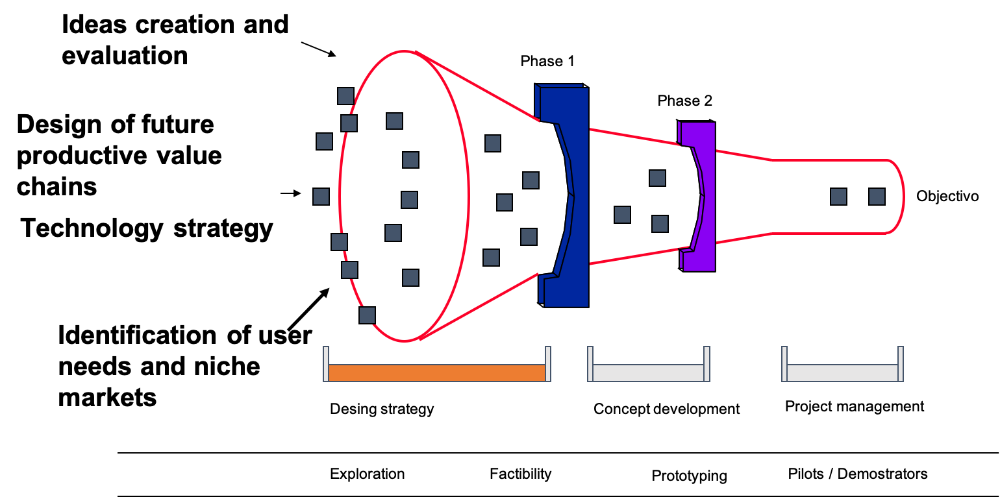

class: clear, center, middle

# How Innovation Labs could help to mitigate .brand-red[climate change]: academy-industry partnerships for success?

???
??? 

- Thank you for being connected and thank you for invitating me in these enginnering conection organized by the University.
- My name is Fabio Cruz. I’m researcher at the University of Lorraine. 
- In these fifteen minutes, my main point is to present some our our perspective of distributed recycling approach framed in the  the climate change issues

- The global question the presentation is how innovation labs could help to mitigate climate change. 
- from a perspective of academy-industry partnetships experiences

- So let me begin very quickly to this climate change umbrella problem. 

---
class: middle, left
background-image: url(Figures/IPCC-Climate-change.jpeg)
background-position: right
background-size: contain

# Societal Challegue    Climate change 

.footnote[Source: Intergovermental pannel on Climate change https://www.ipcc.ch/ ]

???

-  According to the Intergovermental pannel from 2018,  We know that climate change, and precisely, the effort to limite the temperature 1.5 degress is the main challengue. 

---

# Climate change 

.left-column[.footnotesize[

- Global warming estimations
- 6000 scientific references
- Awareness of the impact of human activity
- With 2°C, many ecosystems (corals) will disappear

**We need to find ways for meeting  the needs of all people within the means (boundaries) of the living planet.** 
]]

.right-column[
.polaroid[  ]
 
.footnote[Source: Intergovermental pannel on Climate change https://www.ipcc.ch/ ]
]

???

- an increase of the temperature beyond this value, could implicate tipping points for ecosystem, 
- and these tipping points we don't know the impact in the global equilimbium between ecological systems and human systems. 

- Two conclusion from these
 - We need to find ways for meeting  the needs of all people within the means of the living planet. 

---
class: middle, center

# Can we continue in the same mental (economic) model ?

???

So the question is Can we continue in the same mental (economic) model ?

---
## We need to reframe a new model!  `r icon::fa("exclamation-triangle", pull = "right")`

???

---
class: middle, left
background-image: url(Figures/Emissions-by-sector.png)
background-position: right
background-size: contain

## Where do global   greenhouse gas   emissions come from?

- Towards a neutral climate 
- Improvements in sector sector counts

???

- And what I mean by that is the linear approach for. 

---
class: middle, left
background-image: url(Figures/Doughnut-Economics.jpg)
background-position: right
background-size: contain

## Intensive research on   what could be an   alternative model...

.pull-left[
.tiny[Calisto Friant, M., Vermeulen, W.J.V.,   Salomone, R., 2020. A typology of circular economy discourses:   Navigating the diverse visions of a contested paradigm.  Resour. Conserv. Recycl. 161, 104917. https://doi.org/10.1016/j.resconrec.2020.104917
]]

???

- There have been enourmes research on discourse of a circular econmy. 
- Which it would take many day to get in detail.

- What I want to focus is one approach that we found very holistic and systemics

---
class: middle, left
background-image: url(Figures/Doughnut.png)
background-position: right
background-size: contain

# Doughnut Economics

- Need to a holistic view other than GDP growth
- 'Sweet spot' between   minimal social requirements **AND**   Biophysical earth's boundaries.

.footnote[Raworth, K. A Safe and Just Space for Humanity: Can We Live within the Doughnut? Oxfam: Oxford, UK, 2012.
]

---
class: middle, left
background-image: url(Figures/Doughnut-2.png)
background-position: right
background-size: contain

# Doughnut Economics

- Need to a holistic view other than GDP growth
- 'Sweet spot' between   minimal social requirements **AND**   Biophysical earth's boundaries.
- Many index to evaluate for a country.

.footnote[Raworth, K. A Safe and Just Space for Humanity: Can We Live within the Doughnut? Oxfam: Oxford, UK, 2012.
]

???

- This approach is called Doughnut Economics proposed by the researcher Kate Raworth from Oxford and Cambrigde

---
# Doughnut Economics: .blue[Chile vs France]

.center[]

.footnote[O’Neill, D. W., Fanning, A. L., Lamb, W. F., & Steinberger, J. K. (2018). A good life for all within planetary boundaries. Nature sustainability, 1(2), 88-95. More details: https://goodlife.leeds.ac.uk .
]

---
class: middle, left
background-image: url(Figures/Planetary-boundaries-1.jpg)
background-position: right
background-size: contain

# Doughnut Economics:   .blue[World]

.pull-left[

- Imagine a country that satisfy the basic needs:  a long, healthy, happy life. 

- Now, imagine this same country can do this without while use natural ressources in a sustainable way 

- What about if all countries would do the same

]

.footnote[O’Neill, D. W., Fanning, A. L., Lamb, W. F., & Steinberger, J. K. (2018).  A good life for all within planetary boundaries. Nature sustainability, 1(2), 88-95.      https://goodlife.leeds.ac.uk 
]

---
class: middle

# How  Innovation Labs to mitigate climate change: .brand-blue[<ins>academy-industry partnerships</ins>] for success?

???

- Going back to our initial question, I would like to frame your attention in this notion of
- academy-industry partnership
- and more important, the role that Universities can play given this big issue of climate change

---
# Production and transfer knowledge

.left-column[
- Towards  a **Mode 3** for $21^{st}$ century
]
.right-column[

]

.footnote[
- Rayna, T., Striukova, L., 2020. Fostering skills for the 21st century: The role of Fab labs and makerspaces. Technol. Forecast. Soc. Change 120391. https://doi.org/10.1016/j.techfore.2020.120391
- The New Production of Knowledge: The Dynamics of Science and Research in Contemporary Societies, 2010. . SAGE Publications Ltd, 1 Oliver’s Yard, 55 City Road, London EC1Y 1SP United Kingdom. https://doi.org/10.4135/9781446221853
]

???

- We know from the literature, we have globally thre modes of production and transfer knowledge. 
- Mode 1
- Mode 2
- What we neet for wicked and systematic problems, is mode 3
  - Knowlede innovation mode (open innovation, and co-creation)
  - To integrate the community
  - We create together with users, the knowledge 

---
class: left
background-image: url(Figures/Helix-5.svg)
background-position: right
background-size: contain

# Quintuple Helix of Innovation

.pull-left[
- 
]

.footnote[
- Carayannis, Elias G. and David F. J. Campbell. 2012. “Mode 3 Knowledge Production in Quadruple Helix Innovation Systems.” Pp. 1–63

- Camargo, Morel, Lhoste. Progressive University Technology Transfer of Innovation Capabilities to SMEs: an Active and Modular Educational Partnership. New Perspectives in Technology Transfer (2020) 

]

---
# The Fuzzy-front End of Innovation

.pull-left[

- Think early in thesustainable design and their impact
]
.pull-right[

]

.footnote[
Martinez-Hernandez, E., 2017. Trends in sustainable process design—from molecular to global scales. Curr. Opin. Chem. Eng. 17, 35–41.   https://doi.org/10.1016/j.coche.2017.05.005 
]

---
class: middle

# How .green[<ins>Innovation Labs</ins>] to mitigate climate change: academy-industry partnerships for success?

---
class: middle, right
background-image: url(Figures/LF2L-2.jpg)
background-position: left
background-size: contain

# Lorraine  Fab Living  Lab 

http://lf2l.fr/ 

---
class: middle, right
background-image: url(Figures/LF2L-Methodology.jpg)
background-position: left
background-size: contain

# Lorraine  Fab Living  Lab 

http://lf2l.fr/
---

class: middle, right
background-image: url(Figures/LF2L-Technologies.jpg)
background-position: left
background-size: contain

---
class: middle, center

---

## The problem: Plastic waste

.pull-left[ 
- US recycled less than 9% of its plastic waste.
- EU, recycled about 30%. However, this number is what is collected, not from what is in circulation*. 
- China’s ban on plastic trash
- Plastic trash could top 13 billion tons by 2050
- Economics of plastic recycling historically have been challenging
- Little financial incentive to encourage consumers to recycle their own plastic waste

## We barely recycle plastic!!.. 
]

.pull-right[ 

]

.footnote[
*Kranzinger, L., Pomberger, R., Schwabl, D., Flachberger, H., Bauer, M., Lehner, M., Hofer, W., 2018. Output-oriented analysis of the wet mechanical processing of polyolefin-rich waste for feedstock recycling. Waste Manag. Res. 36, 445–453
]

---

# Distributed recycling via additive manufacturing (DRAM)

.pull-left[
- Local closed loop
- AM adds value
- Small quantities 

- Reduction of landfilling
- Minimize the use of virgin materials

]
.pull-right[

http://lf2l.fr/projects/green-fablab
]

---

# Distributed recycling via additive manufacturing (DRAM)
Technical system

---

# Distributed recycling via additive manufacturing (DRAM)
Technical system

---

# Distributed recycling via additive manufacturing (DRAM)
Technical system

---

# Distributed recycling via additive manufacturing (DRAM)
Technical system

---

# Distributed recycling via additive manufacturing (DRAM)
Technical system

.center[]

---

# Distributed recycling via additive manufacturing (DRAM)
Technical system

.center[]

---

# Distributed recycling via additive manufacturing (DRAM)

Taking into account the environment and their ecosystem services (ES).

.pull-left[

]

--

.pull-right[

- How the future recycling chain could be including the environment?
]

---

# Distributed recycling via additive manufacturing (DRAM)

Global system

.pull-left[

]

.pull-right[
- Establish and evaluate scenarios in a systemic and dynamic way

- Evaluate the influences of the main operating variables on the system

- Taking into account the priorities of the multiple stakeholders

- Facilitate your decision making public-private actors
]
.footnote[
Santander, P., Cruz Sanchez, F.A., Boudaoud, H., Camargo, M., 2020. Closed loop supply chain network for local and distributed plastic recycling for 3D printing: a MILP-based optimization approach. Resour. Conserv. Recycl. 154, 104531. https://doi.org/10.1016/j.resconrec.2019.104531 
]

---
class: middle, left
background-image: url(Figures/educator.jpg)
background-position: right
background-size: contain

# To conclude

- An imperative to act now for the planet
- Assuming our role from the university 
- A holistic, systemic and interdisciplinary vision   is necessary 
- Technology must be considered in   its socio-technical context
- True interdisciplinarity is fundamental  *(let's take the risk)*
- Community integration is indispensable,  it's about **co-building solutions**. 

---
class: middle, center

# Thanks..

### cruzsanc@univ-lorraine.fr

